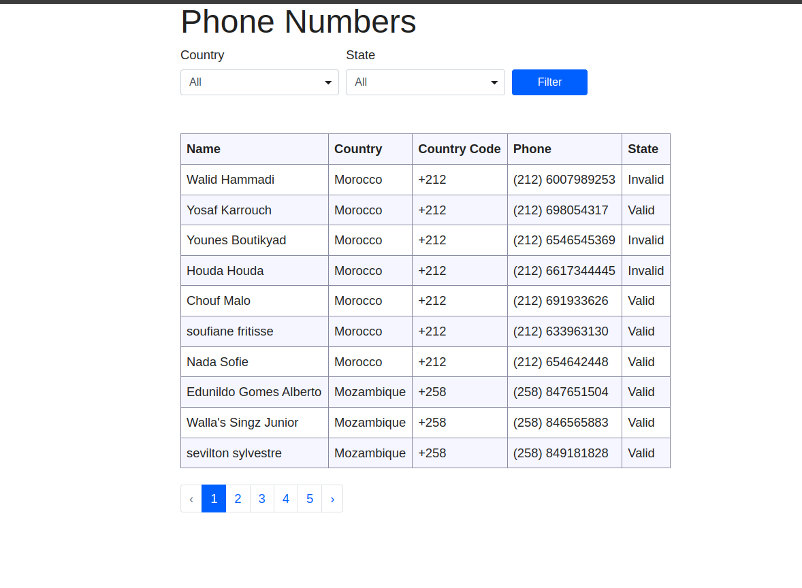
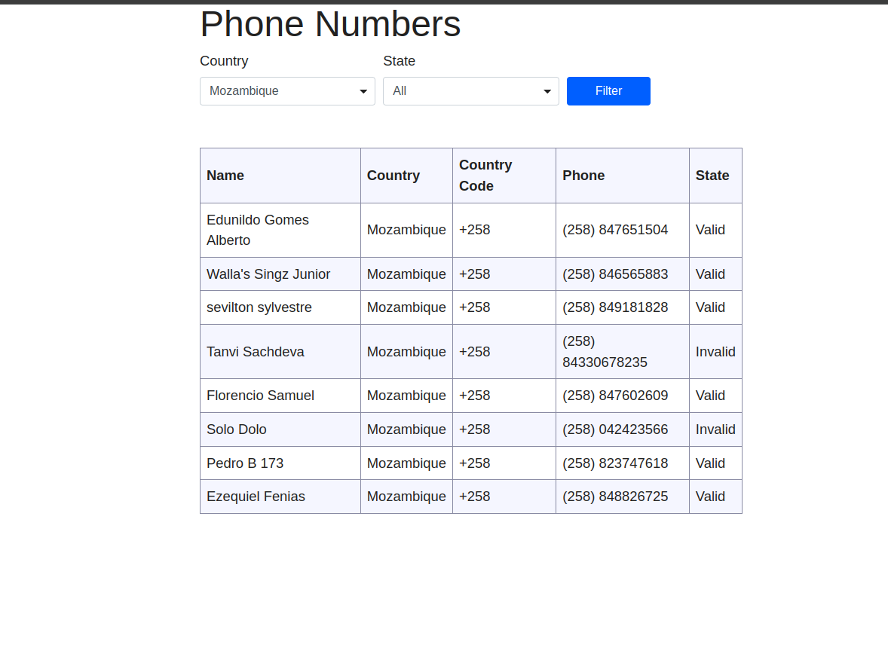
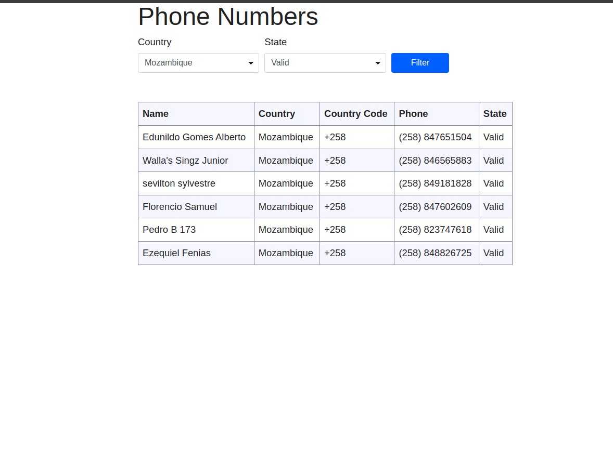

# 📱 Phone Book Application

The Phone Book Application is a single-page web application that lists and categorizes country phone numbers.
It categorizes numbers by country, validation state (valid or invalid), country code, and the phone number itself.

Users can:

View all phone numbers stored in the database.

Filter results by country and validation state.
Browse through paginated results with server-side rendering.

---

## 🛠 Tech Stack

- **Backend:** PHP (Laravel Framework)
- **Frontend:** Blade Templates / HTML / CSS
- **Database:** SQLite3
- **Version Control:** Git & GitHub

---

## 📦 Installation

### 1 Clone the repository
```bash

git clone https://github.com/MahmoudReda-K/phone-book.git
cd phone-book

```

### 2 Install dependencies
```bash

composer install
````
### 3 Environment setup
```bash

cp .env.example .env
```
Note: You must set the correct absolute path to your local SQLite database file in the .env file.
Ex: "/var/www/html/work/phone-book/database/sample.db"


### 4 Generate application key
```bash

php artisan key:generate
```

### 5  Running the Application
```bash

php php artisan serve

```

Your app will be available at:
http://127.0.0.1:8000

### 6  📸 Screenshots






